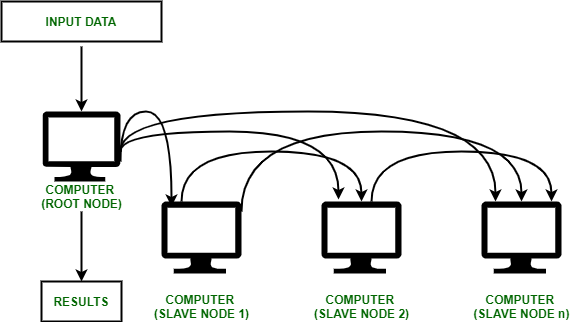
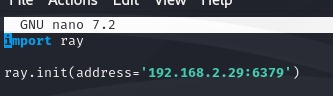
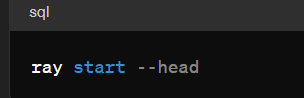
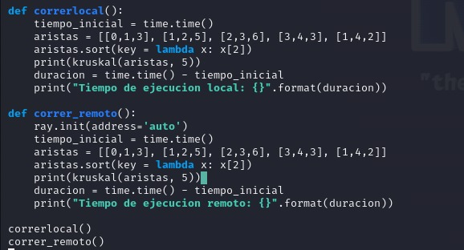



Actividad 3 Sistemas Operativos PARTE II

Juan Esteban Becerra Gutiérrez

Alejandro Sarmiento Rivera

José Daniel Ramirez Delgado

Facultad de ingeniería de sistemas y computación 

Sistemas Operativos

Pontificia Universidad Javeriana Cali 2024-1

**Descripción del ejercicio:**

En este ejercicio, el/la estudiante llevará a cabo el despliegue de un ambiente computacional distribuido sobre el cual se ejecutará una aplicación de forma distribuida. Ejemplo de una aplicación distribuida es una que se encargue de renderizar una serie de imágenes y generar un video.

El ejercicio se puede pensar que tiene tres etapas:

● Despliegue del cluster computacional

● Despliegue del framework para el desarrollo de aplicaciones

● Desarrollo de la aplicación

Descripción gráfica del ejercicio a implementar. Íconos tomados de: https://openclipart.org/

**Implementación:**

Para la ejecución de este ejercicio, se requirieron 3 máquinas virtuales Linux de distribución Kali por la facilidad al manejar el sistema operativo, a pesar de que las 3 máquinas requieran bastantes recursos, pero no fue el caso. Para el ejercicio en cuestión, se implementó Ray, un framework unificado y de código abierto que permite escalar aplicaciones de inteligencia artificial y Python, como el aprendizaje automático. Proporciona la capa de cómputo para el procesamiento paralelo, lo que te libera de ser un experto en sistemas distribuidos. Ray minimiza la complejidad de ejecutar tus flujos de trabajo distribuidos individuales y de aprendizaje automático de extremo a extremo gracias a estos componentes:

- **Bibliotecas escalables para tareas comunes de aprendizaje automático:** preprocesamiento de datos, entrenamiento distribuido, ajuste de hiperparámetros, aprendizaje por refuerzo y servicio de modelos.
- **Primitivas de computación distribuida Pythonic:** para paralelizar y escalar aplicaciones Python.
- **Integraciones y utilidades:** facilitan la integración e implementación de un cluster de Ray con herramientas e infraestructura existentes como Kubernetes, AWS, GCP y Azure.

Para el ejercicio las 3 máquinas usaron asignamiento de IP automático, lo que hay que tener en cuenta es que como ordena el ejercicio, las máquinas esclavas deben conocer la IP de la máquina maestra para la correcta ejecución de la/s tarea/s en cuestión.

**Implementación**

   Para la implementación del ejercicio se requirió de la instalación del framework en todas las máquinas a usar mediante el siguiente comando y que las 3 máquinas contengan tanto la misma versión de python como de Ray.

   

   Posterior a esto en la máquina maestra, se debe crear un archivo .py que contenga el programa a ejecutar, importando la librería de Ray. Importante declarar en el programa principal 2 cosas importantes.

1. Iniciar ray en modo maestro con el comando ‘ray.init(addres=’auto’). Con esto al iniciar el cluster, el framework nos asigna la IP que tenga la máquina y un puerto para poder hacer la conexión.
2. Por cada función que se desea ejecutar remotamente, se debe colocar por encima de esta el indicar ‘@ray.remote’.

En la siguiente imágen se muestra una plantilla de cómo se debe armar un programa python en la máquina maestra del cluster.

Para las máquinas esclavas, al igual que la maestra, deben tener Ray instalado para la correcta ejecución del ejercicio. En el caso de estos dispositivos, solo se necesita este pequeño programa:

Para el caso de la función ‘ray.init()’, las máquinas deben conocer la IP de la máquina maestra, así cuando el cluster se inicie, las máquinas esclavas puedan conectarse correctamente con la maestra y hacer la tarea requerida.

**Ejecución**

La ejecución del ejercicio es bastante sencilla, para empezar hay que ejecutar el comando ‘ray start –head’ en la máquina maestra para que el framework nos de la IP y puerto a asignar a las máquinas esclavas.

Input:

Output:

Posterior a esto, en las máquinas esclavas se debe ejecutar el programa donde se tenga los comando de ray con ‘python programa.py’, para que estas se puedan conectar con la máquina maestra.

Para este ejemplo se evalúa el tiempo de ejecución de un algoritmo Kruskal (un algoritmo que busca encontrar el árbol de cubrimiento mínimo, es decir, que sus nodos están conectados con las aristas de menor peso) localmente y remotamente en las imágenes a continuación:

El programa completo se encuentra en el enlace que redirige al repositorio github con los códigos del ejercicio.

**Dificultades**

   A la hora de desarrollar el ejercicio se encontraron pequeños percances a la hora de implementar Ray, primero que nada, el soporte de Windows para Ray está en etapa alpha y segundo por problemas legales con servicios como Anaconda no se puede obtener Ray legalmente, por estas razones, se optó por una instalación basada en Linux.

   El problema surge porque hoy en día la mayoría busca mantener sus entornos Python bien separados, lo que significa que en lugar de pip, usualmente se usa un gestor de paquetes como venv/virtualenv, pipenv, pew o conda. Aquí es donde las cosas se complican.

   Debido a este cambio, muchos en la comunidad de aprendizaje automático han migrado a otros gestores de paquetes. Desafortunadamente, herramientas básicas como venv (incluida en la librería estándar de Python desde la versión 3.3) y virtualenv no funcionan con Ray en Windows. Para empeorar las cosas, pipenv también utiliza venv internamente, por lo que tampoco es compatible. Esto excluye a la mayoría de las alternativas populares a conda.

   Otra dificultad menor, es que al inicio de la implementación, se iba a usar una máquina con CentOS, sin embargo, al hacer la instalación de python y Ray, la versión máxima que se maneja en el sistema operativo era python 3.6 y Ray 2.1, lo cual era un impedimento a la hora de hacer el ejercicio ya que todas las máquinas deben tener la misma versión de python y de Ray que en este caso se trabajó con python 3.11.8 y Ray 2.4.

**Conclusiones**

   En resumen, Ray es una herramienta poderosa que permite a científicos de datos, ingenieros de aprendizaje automático y desarrolladores crear y ejecutar aplicaciones de inteligencia artificial y Python a gran escala de manera simple y eficiente.

   Sin embargo, esta herramienta está limitada a trabajar con sistemas operativos más especializados y específicos a los de uso común en el caso de querer ser implementado para un entorno laboral debido a que el manejo de versiones del lenguaje de programación y del framework es bastante importante para la ejecución de los mismos.

**Link del Github:**

A continuación, se va a alojar un link al repositorio que contiene los archivos necesarios para la configuración de las máquinas:

<https://github.com/JebUser/RAY_ACT.git>

**Referencias Bibliográficas:**

[1]	**<https://chat.openai.com>**.

[2]	*How to install Ray under Windows*. (s. f.). B.Telligent. 

[3]	https://www.btelligent.com/en/blog/how-to-install-ray-under-windows/*Installing Ray — Ray 2.20.0*. (s. f.). https://docs.ray.io/en/latest/ray-overview/installation.html

*[4]	Overview — Ray 2.20.0*. (s. f.). https://docs.ray.io/en/latest/ray-overview/index.html

[ref1]: Aspose.Words.6753a738-4de3-4df2-9d82-7edf87b2cb53.007.png
[ref2]: Aspose.Words.6753a738-4de3-4df2-9d82-7edf87b2cb53.009.png
